# Hasil Screnshoot tugas_praktikum jobsheet 2 column
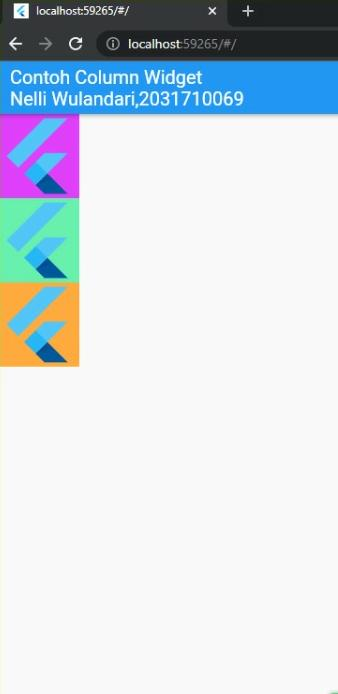

# Hasil Screnshoot tugas_praktikum jobsheet 2 grid

# Hasil Screnshoot tugas_praktikum jobsheet 2 list

# Hasil Screnshoot tugas_praktikum jobsheet 2 property_alignment
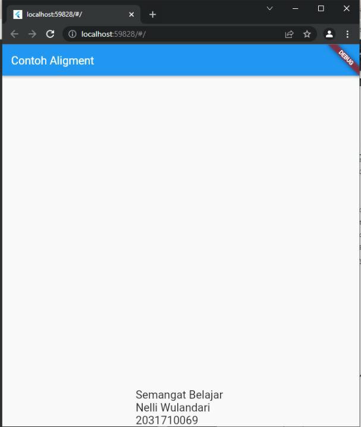

# Hasil Screnshoot tugas_praktikum jobsheet 2 property_child
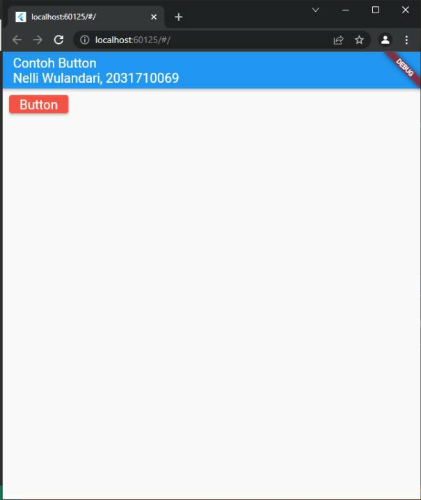

# Hasil Screnshoot tugas_praktikum jobsheet 2 property_color
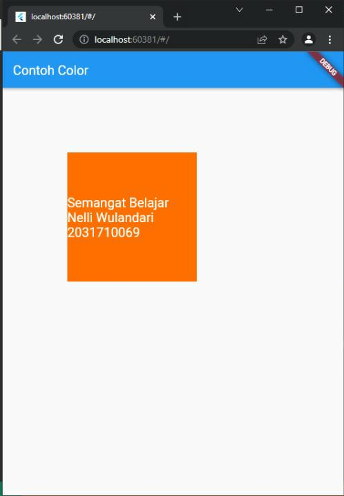

# Hasil Screnshoot tugas_praktikum jobsheet 2 property_decoration
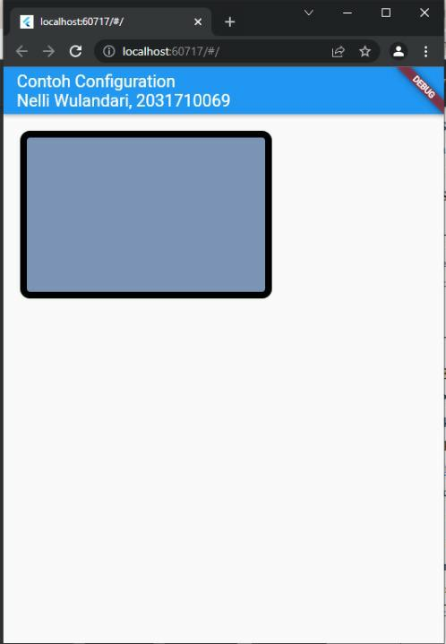

# Hasil Screnshoot tugas_praktikum jobsheet 2 property_height_width
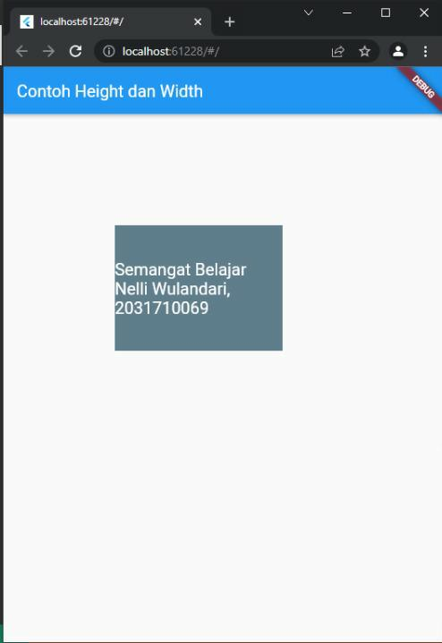

# Hasil Screnshoot tugas_praktikum jobsheet 2 property_margin
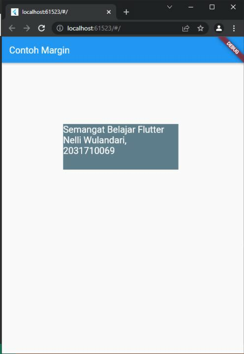

# Hasil Screnshoot tugas_praktikum jobsheet 2 property_padding
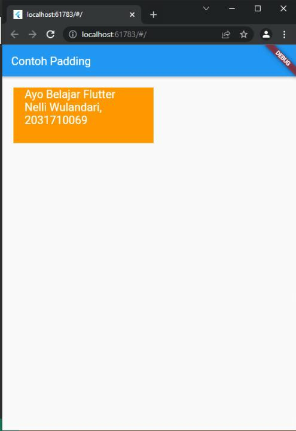

# Hasil Screnshoot tugas_praktikum jobsheet 2 property_transform
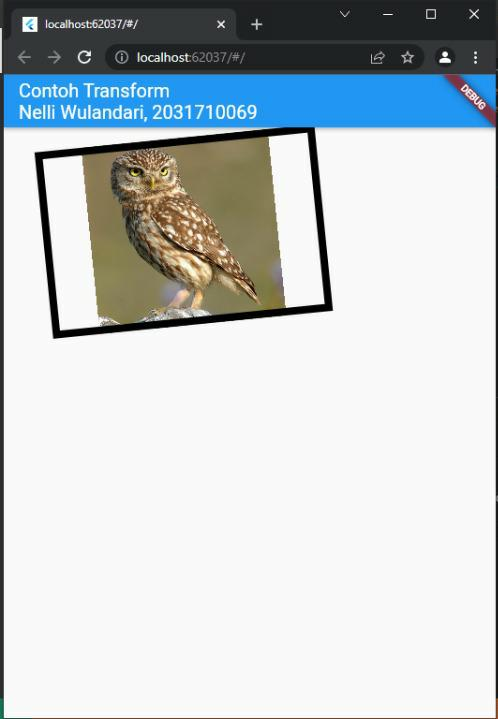

# Hasil Screnshoot tugas_praktikum jobsheet 2 row
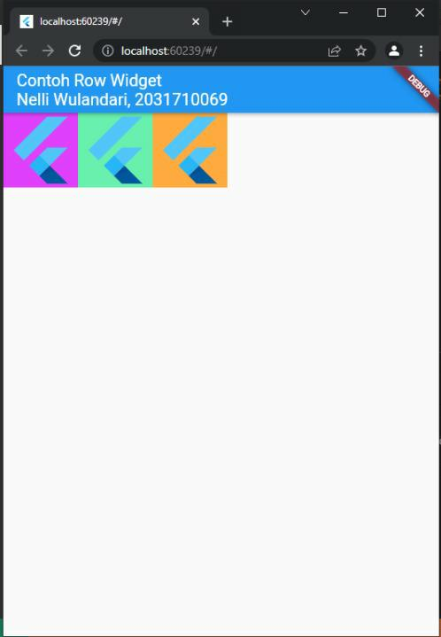

# Hasil Screnshoot tugas_praktikum jobsheet 2 stack
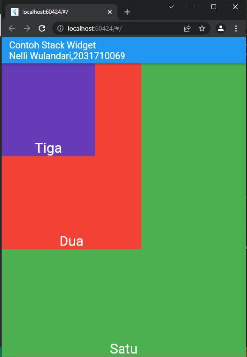

# Hasil Screnshoot tugas_praktikum jobsheet 2 button
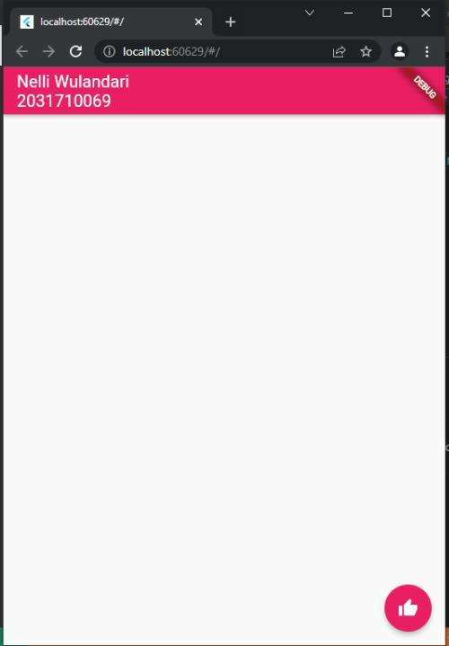

# Hasil Screnshoot tugas_praktikum jobsheet 2 date
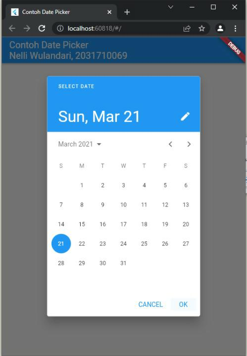

# Hasil Screnshoot tugas_praktikum jobsheet 2 dialog
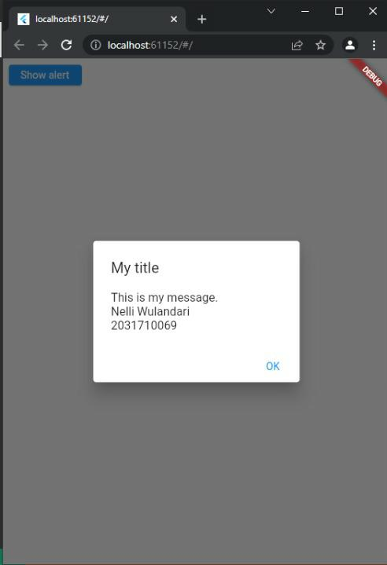

# Hasil Screnshoot tugas_praktikum jobsheet 2 image_widget
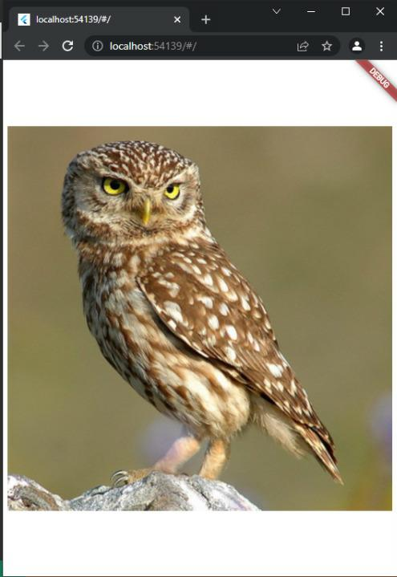

# Hasil Screnshoot tugas_praktikum jobsheet 2 input
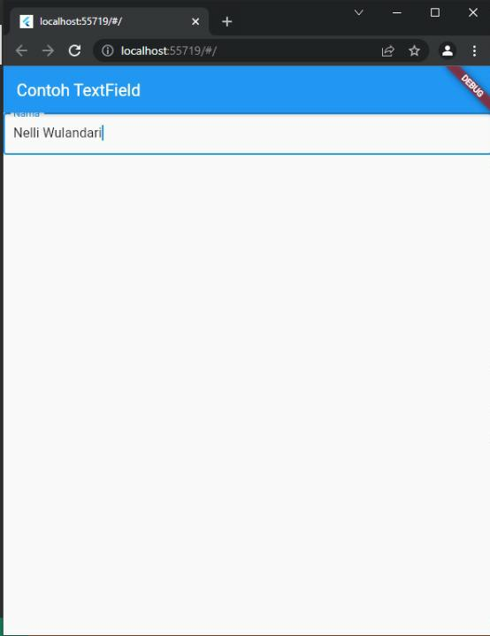

# Hasil Screnshoot tugas_praktikum jobsheet 2 material_design

# Hasil Screnshoot tugas_praktikum jobsheet 2 scaffold
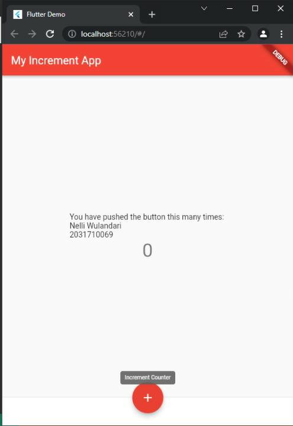

# Hasil Screnshoot tugas_praktikum jobsheet 2 test_widget
